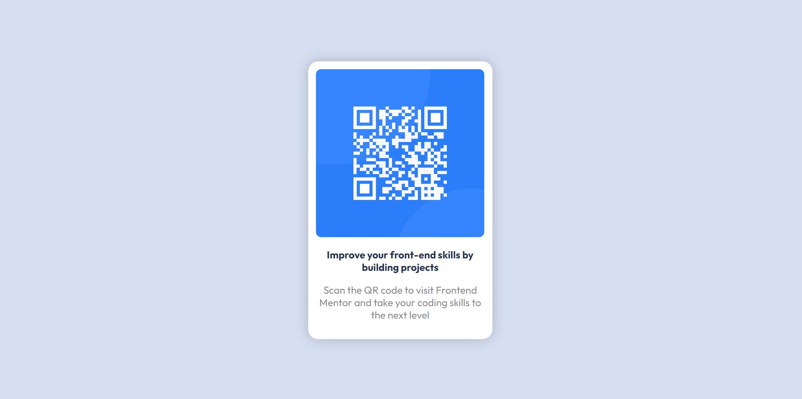

# Frontend Mentor - QR code component solution

This is a solution to the [QR code component challenge on Frontend Mentor](https://www.frontendmentor.io/challenges/qr-code-component-iux_sIO_H). Frontend Mentor challenges help you improve your coding skills by building realistic projects. 

## Table of contents

- [Overview](#overview)
  - [Screenshot](#screenshot)
  - [Links](#links)
- [My process](#my-process)
  - [Built with](#built-with)
  - [What I learned](#what-i-learned)
  - [Continued development](#continued-development)
- [Author](#author)

### Screenshot

### Links

- Solution URL: [GitHub Repo](https://github.com/Priyanshu-Prime/QR-Card)
- Live Site URL: [Website Link](https://priyanshu-prime.github.io/QR-Card/)

## My process
I started with looking at the expected design, and then tried to add all the elements together first in the HTML file. I then proceeded to work upon the styling of the page, adding all the necessary details I could see with my eyes and trying to be as close to the required result as possible.

### Built with

- Semantic HTML5 markup
- CSS custom properties
- Flexbox
- CSS Grid

### Continued development

I would like to keep working and learning the flexbox properties as those take me the most amount of time, due to alignment issues.

## Author

- Frontend Mentor - [@Priyanshu-Prime](https://www.frontendmentor.io/profile/Priyanshu-Prime)
- LinkedIn - [Priyanshu Makwana](https://www.linkedin.com/in/priyanshu-makwana-277b93261/)